<p align="center">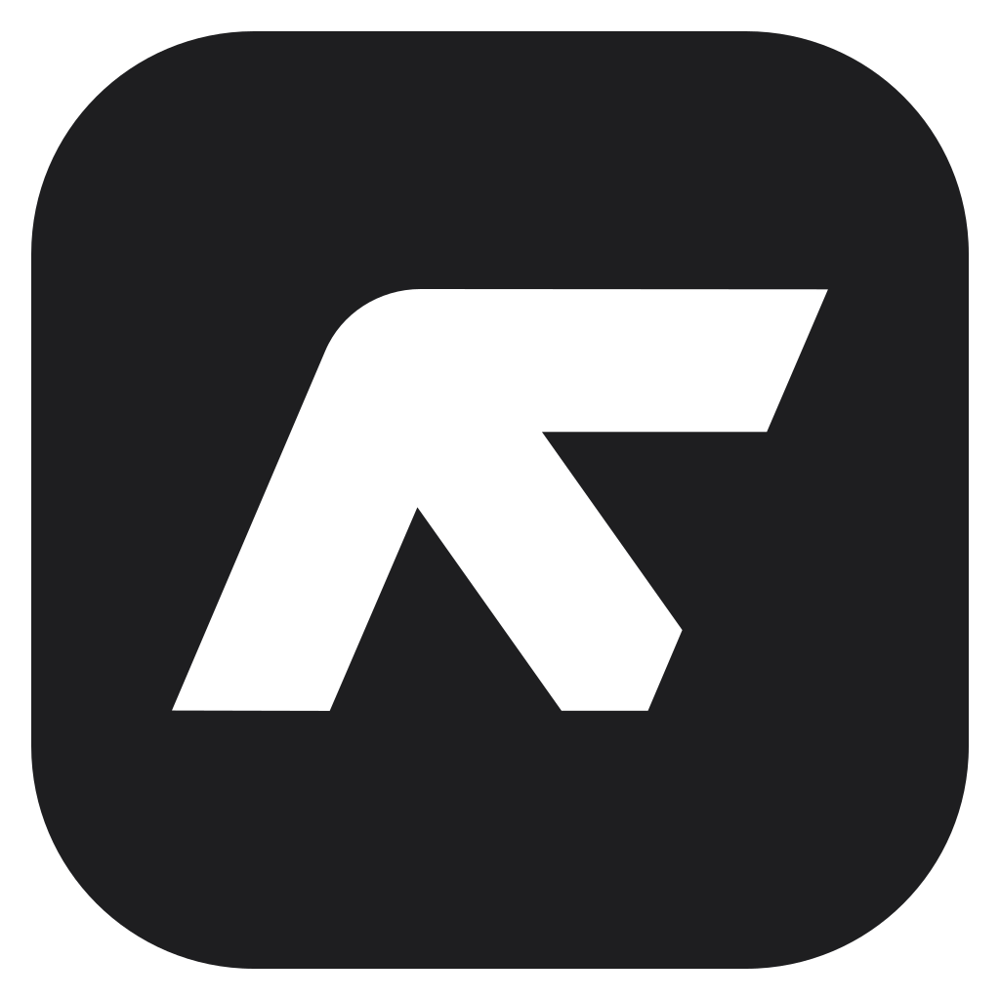</p>

# AShot

Скриншоты экрана из трея Windows: выделение области, окна или отдельного элемента,
рисование поверх снимка, история последних снимков и публикация в Box.com
с короткой ссылкой, которая открывается и на телефоне.

Прототип по функциям — [Greenshot](https://getgreenshot.org/); часть UX и модуль
подсветки элементов взяты из [Snow Shot](https://github.com/mg-chao/snow-shot).

<p align="center">
  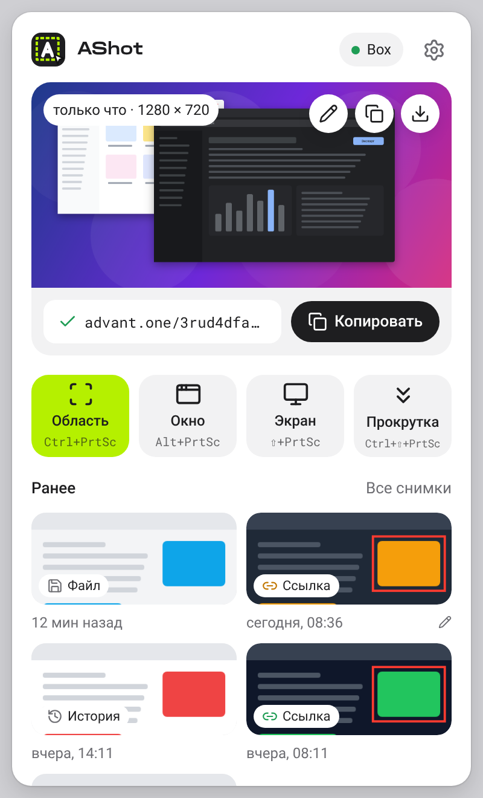
  &nbsp;
  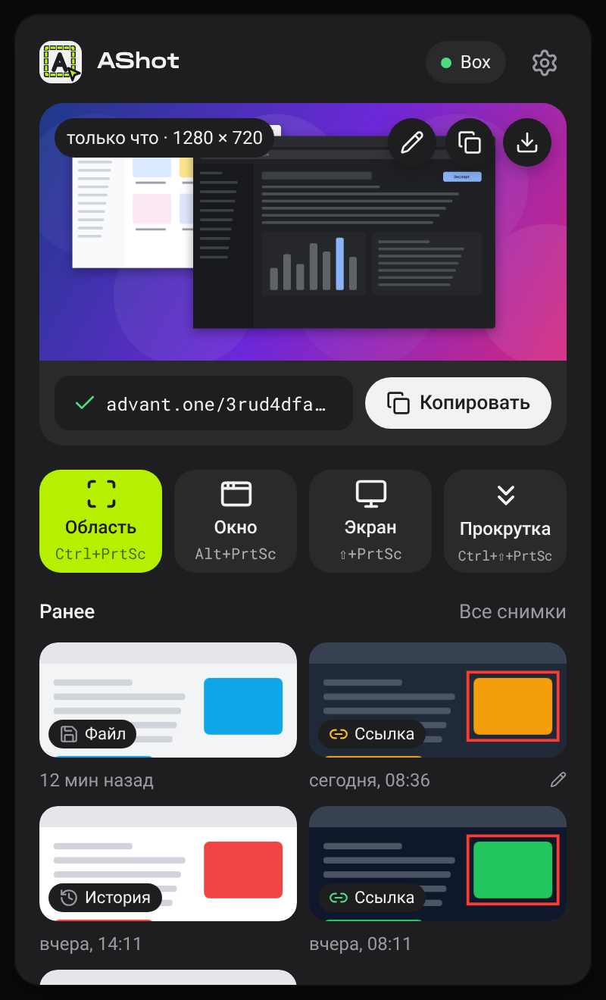
</p>
<p align="center">
  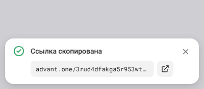
  &nbsp;
  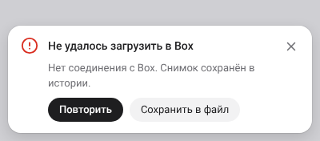
</p>

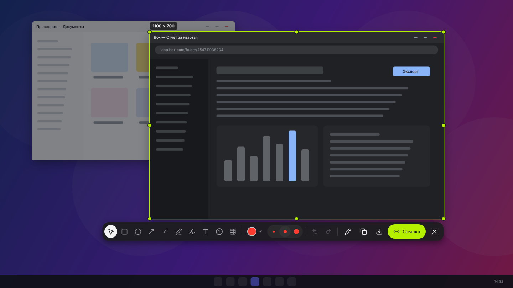

## Возможности

**Трей**
- Панель по клику на иконку: последний снимок крупно — правка, копирование, сохранение и ссылка
  с кнопкой «Копировать» (или «Получить ссылку»).
- Режимы съёмки в одну линию (с горячими клавишами): *Область*; *Окно* — подсвечиваются и
  выбираются только окна целиком (без элементов внутри и без свободной рамки), выбор — кликом;
  *Экран* — **сразу в редакторе** (если экранов несколько — кликните по нужному; «Все мониторы» в
  настройках — все сразу); *Прокрутка* — страница целиком
  (см. [ниже](#снимок-с-прокруткой)).
- «Ранее» — предыдущие снимки (всего хранится 10, лимит настраивается) с отметкой: ссылка, файл
  или только история; клик — редактор, правый клик или «⋯» — копировать, ссылка, сохранить, удалить.
- Статус Box в шапке: зелёная точка — подключён, «Войти в Box» — вход в один клик.
- Правый клик по иконке в трее — меню (снимки, настройки, «О программе», выход).

**Настройки** — сохраняются сразу, без кнопки «Сохранить»: *Снимок* (курсор — **выключен по
умолчанию**, лупа, «Весь экран», действие после выделения), *Горячие клавиши*, *Сохранение* (папка,
имя файла, формат, история), *Загрузка и ссылки* (аккаунт Box, папка, доступ, домен ссылок),
*О программе* (версия, коммит, дата сборки, **тема: системная / светлая / тёмная**, **масштаб
интерфейса** 80–150% — панель в трее, редактор, панели экрана выделения и настройки, автозапуск,
обновления, журнал).


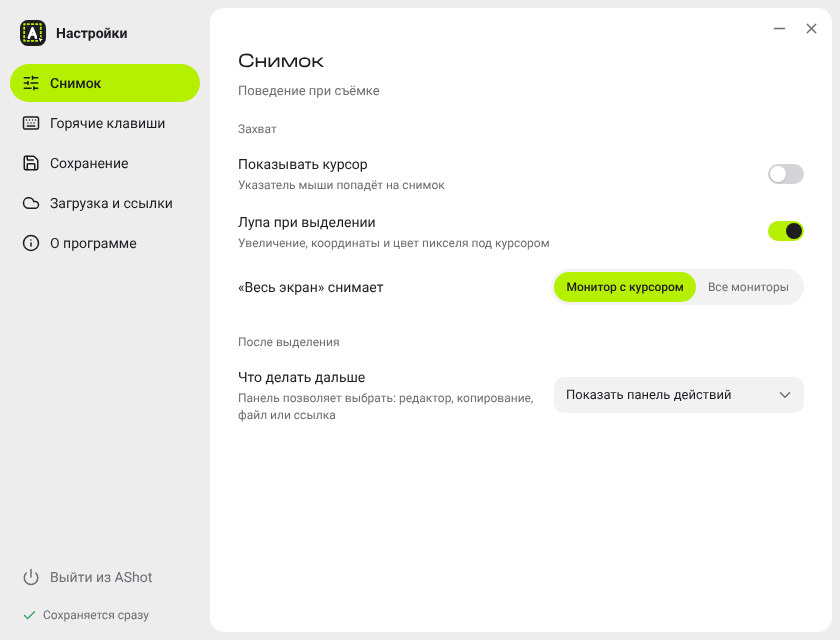

**Выделение и рисование прямо на экране** (`Ctrl + PrtSc`) — как в Snow Shot / Snipaste
- Экран «замораживается»; тянем рамку мышью или кликаем по подсвеченному **окну
  или элементу внутри окна** (кнопка, панель, список — через UI Automation; в Firefox — ещё и
  через MSAA, см. [ниже](#ограничения-текущей-версии)). Колесо мыши — уровень элемента.
- Лупа с сеткой пикселей, координатами и цветом (`C` — скопировать HEX).
- Сразу после выделения под рамкой появляется компактная панель: **рисуем прямо на экране** —
  прямоугольник / эллипс и карандаш / маркер (по одной кнопке со стрелкой-выпадашкой; по умолчанию
  прямоугольник и карандаш, кнопка запоминает последний выбор), стрелка, линия, текст, нумерация
  шагов, пикселизация; цвет, толщина и номер следующего шага — выпадающие списки (нумерацию можно начать с любого
  числа). Текст с протяжкой — **выноска**: нажмите на то, что нужно показать, протяните и отпустите —
  появится стрелка к точке нажатия и поле для текста у её хвоста. Галочка **«Уменьшать до N px»** —
  см. «Сохранение и публикация» ниже; над рамкой виден итоговый размер. Отмена/повтор — `Ctrl+Z` / `Ctrl+Y`. Рамку можно продолжать тянуть за ручки, инструмент `V` —
  двигать рамку и фигуры. Последний инструмент запоминается.
- Готово: `Ctrl+C` — копировать, `Ctrl+S` — сохранить (куда и под каким именем; если закрыть диалог,
  выделение остаётся на экране), `Ctrl+U` — **ссылка**, `Enter` или двойной клик — открыть в
  полном редакторе (нарисованное переносится и остаётся редактируемым), `Esc` — отмена.
- Стрелки — сдвиг рамки или выбранной фигуры на 1 px (Shift — 10 px, Ctrl — размер рамки), `F` — весь монитор.

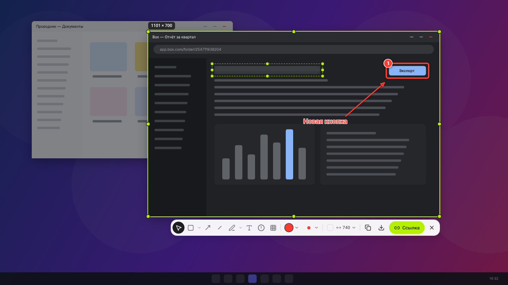

<a id="снимок-с-прокруткой"></a>
**Снимок с прокруткой** (`Ctrl + Shift + PrtSc`, плитка «Прокрутка» в трее) — страница целиком
- Кликните по странице — подсвечивается вся прокручиваемая область (у браузера — страница без вкладок
  и адресной строки), — или выделите область рамкой. Дальше AShot всё делает сам: сначала
  пролистывает страницу до конца по экрану за шаг — чтобы успели загрузиться картинки, которые
  подгружаются при прокрутке, — возвращается в начало и спускается снова, снимая кадры шагами
  чуть больше половины высоты; склеивает их и открывает результат в редакторе (или выполняет
  действие «После выделения» из настроек). Страница потом возвращается на место.
- Прокрутка — через UI Automation, где он есть (Chrome, Edge, Проводник, Office); иначе — колесом
  мыши (Firefox и другие программы). Сколько проходит шаг, AShot узнаёт по самим кадрам. Склейка —
  по совпадению картинки соседних кадров: «липкие» шапка и подвал попадают в снимок один раз,
  шапка, которая прилипает только после прокрутки, подсветка под курсором и полоса прокрутки не мешают.
- Ход — в уведомлении (на сами кадры оно не попадает). `Esc` или «Остановить»: пока страница
  прогружается — отмена, во время съёмки — закончить на текущем месте. Предел — 20 000 px в высоту.
- Каждый шаг пишется в журнал (строки `scrolling capture…` в «О программе → Журнал») — если склейка
  где-то оборвалась, по ним видно почему.

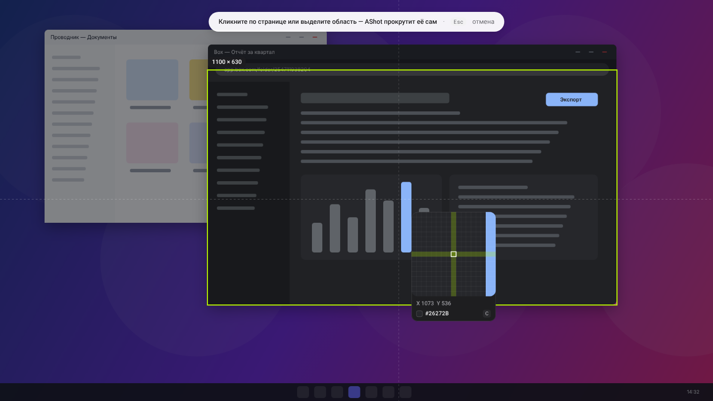

**Полный редактор** (обрезка, масштаб, правка снимков из истории)

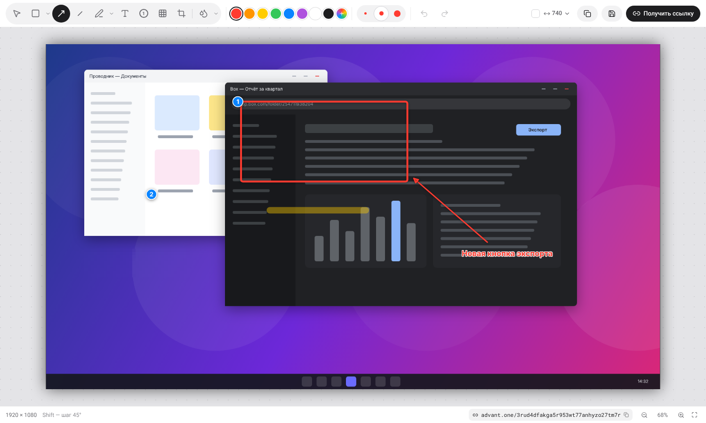

- Прямоугольник / эллипс, стрелка, линия, карандаш / маркер (парные инструменты — одна кнопка с
  выпадашкой, клавиши `R` `E` `P` `M` по-прежнему выбирают каждый), текст, нумерация шагов,
  пикселизация (скрыть данные), обрезка. Shift — квадрат / 45° / прямая.
- **Водяной знак и копирайт** — одна кнопка с выпадашкой. *Водяной знак* повторяет текст или
  картинку (логотип: PNG с прозрачностью, JPG, WebP) по всей картинке наклонными рядами, под
  рисунками; наклон 0° / 30° / 45°, частота повторов, размер, непрозрачность. *Копирайт* — один раз,
  в выбранном месте (9 положений), дальше его можно двигать и тянуть за ручки. Настройки и картинка
  запоминаются (`%APPDATA%\one.advant.shoter\watermark.png`), изменения в выпадашке сразу видны на
  снимке; при «Уменьшать до N px» знак крупнее, чтобы после уменьшения читался.
- Нумерация шагов с любого числа (выпадающий номер на панели: 1–15 или своё число; после
  отмены счёт откатывается). Текст с протяжкой — выноска со стрелкой.
- «Уменьшать до N px» — та же галочка, что на экране выделения; в строке состояния — итоговый размер.
- Палитра + свой цвет, 3 толщины (`1`/`2`/`3`), выбор и перемещение, ручки размера,
  отмена/повтор, масштаб (`Ctrl+колесо`, `Ctrl+0`, `Ctrl+1`), панорама (пробел / средняя кнопка).
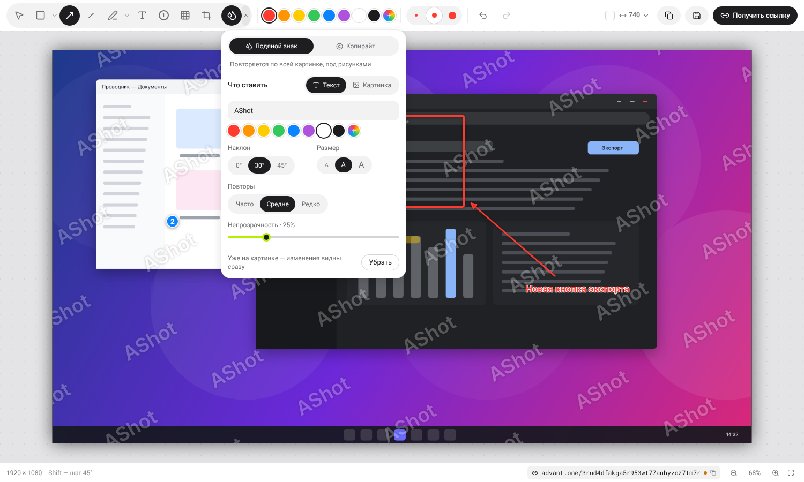

- Аннотации сохраняются отдельно от исходника — снимок из истории можно **переоткрыть и
  продолжить редактировать** фигуры.

**Сохранение и публикация**
- **Уменьшать до N px** (галочка на панели экрана выделения и редактора, настройки — в её выпадающем
  списке): всё, что уходит из программы — копирование, сохранение, ссылка, в том числе из трея, —
  уменьшается с сохранением пропорций по ширине, высоте или длинной стороне (например, 1920 → 740).
  Меньшие картинки не увеличиваются; в истории остаётся полный размер, поэтому галочку можно снять
  и выдать снимок заново. «Утолщать линии и текст» — рисунки рисуются толще ровно настолько, чтобы
  после уменьшения выглядеть обычно. Галочка и размер запоминаются.
- Буфер обмена (PNG + DIB — вставляется в мессенджеры, Office, браузер).
- «Сохранить» на экране выделения и в редакторе — системный диалог: любая папка и своё имя
  (открывается в последней выбранной папке); копия с тем же именем остаётся в папке снимков
  (по умолчанию `Pictures\AShot`). Из трея «Сохранить в папку» — сразу в папку снимков по шаблону
  имени (`{date}`, `{time}`, `{n}` — номер по порядку). Форматы — PNG, JPEG или WebP (без потерь).
- «Получить ссылку» — загрузка в папку Box через API, создание общей ссылки и **замена
  ссылки** по шаблону: `https://app.box.com/s/3rud4dfakga5r953wt77anhyzo27tm7r` →
  `https://<домен-прокси>/3rud4dfakga5r953wt77anhyzo27tm7r` или, без прокси,
  `https://app.box.com/embed/s/3rud4dfakga5r953wt77anhyzo27tm7r`. Ссылка сразу в буфере обмена.
- Временное хранилище: каждый снимок автоматически попадает в историю (`%LOCALAPPDATA%\one.advant.shoter\history`).

## Горячие клавиши

По умолчанию (как в Greenshot):

| Сочетание | Действие |
| --- | --- |
| **`Ctrl + PrtSc`** | снимок области / окна / элемента (окно — кликом по нему, весь монитор — клавишей `F` на экране выделения) |
| **`Alt + PrtSc`** | снимок окна — наведите на окно и кликните |
| **`Shift + PrtSc`** | весь экран — сразу в редактор (несколько экранов — кликните по нужному) |
| **`Ctrl + Shift + PrtSc`** | снимок с прокруткой — страница целиком |

Сочетания меняются в «Настройки → Горячие клавиши» и хранятся в настройках
(`%APPDATA%\one.advant.shoter\settings.json`), переустановку переживают; «Сбросить» в том же разделе
возвращает значения по умолчанию. При обновлении с версии, где была назначена только `Ctrl + PrtSc`,
пустые поля один раз получают значения по умолчанию (если сочетание ещё не занято другим действием).

Если назначаете просто `PrtSc`: в Windows 11 он по умолчанию занят «Ножницами» — отключите
*Параметры → Специальные возможности → Клавиатура → «Использовать кнопку PrtSc для открытия функции захвата экрана»*.

## Установка

Скачайте последнюю версию в **[Releases](../../releases/latest)**:

- `AShot_x.y.z_x64-setup.exe` — установщик (для текущего пользователя, без прав администратора);
- `AShot_x.y.z_x64_ru-RU.msi` — MSI для развёртывания;
- `AShot_x.y.z_x64-portable.exe` — запуск без установки.

Каждый пуш собирается в GitHub Actions (артефакт `AShot-windows-<версия>`, хранится 14 дней);
новый пуш отменяет ещё идущую сборку той же ветки, правки только в документации сборку не запускают.

**Dev-сборки для pull request.** Ветка с открытым pull request собирается как отдельная программа
**AShot Dev** и публикуется пре-релизом `dev-pr-<номер>`; в самом pull request появляется комментарий
со ссылками на установщик и portable (ссылки не меняются от сборки к сборке, комментарий обновляется
при каждом пуше, после закрытия pull request пре-релиз удаляется). AShot Dev ставится **рядом** с AShot
(`one.advant.shoter.dev`: свои настройки, история, вход в Box и запись автозапуска), в трее — светлая
иконка, в панели — метка «DEV · PR #N», сама не обновляется. Горячие клавиши у программ одни и те же —
на время проверки выйдите из AShot (трей → «Выход»). Пре-релизы не считаются «последним релизом»,
поэтому установленные AShot и зеркало обновлений их не видят. Pull request от Dependabot и из форков
(без прав на запись) собираются как обычная ветка, без пре-релиза.
Сборка основной ветки (или ручной запуск *Actions → Build → Run workflow*) после прохождения
тестов публикуется как релиз `v0.1.<номер сборки>` с описанием из коммитов; хранятся 20 последних
релизов. В каждом релизе есть манифест `latest.json` (версия, описание, размеры и SHA-256 файлов) —
по нему программа **обновляется сама**: проверяет его через 30 секунд после запуска и раз в 6 часов
и, если ничего не открыто, ставит новую версию и перезапускается (установщик — тихо поверх,
portable — заменяет свой exe; скачанный файл сверяется с SHA-256 из манифеста). Вручную: «Настройки →
О программе → Проверить обновления»; там же автообновление можно выключить — тогда будет только
уведомление. Манифест берётся с GitHub или со своего сервера — см. ниже.

### Обновления со своего сервера (IIS)

Программа ходит только на ваш сервер, а сервер сам забирает новые релизы с GitHub (раз в 10 минут,
скриптом из [`deploy/iis`](deploy/iis)). Входящий доступ к серверу из интернета не нужен; для приватного
репозитория токен GitHub хранится только на сервере.

1. **IIS.** Папка, например `C:\inetpub\updates\ashot`, опубликованная как сайт или виртуальный каталог
   (например, `https://updates.company.ru/ashot/`) с анонимным доступом на чтение; HTTPS — с любым
   сертификатом, которому доверяет Windows (подойдёт и корпоративный CA). Положите в неё
   [`deploy/iis/web.config`](deploy/iis/web.config): MIME-типы, `latest.json` без кэша.
2. **Скрипт.** Скопируйте [`deploy/iis/Sync-AShotUpdates.ps1`](deploy/iis/Sync-AShotUpdates.ps1)
   в `C:\AShot-mirror\` и запустите вручную (PowerShell от администратора):

   ```powershell
   powershell -NoProfile -ExecutionPolicy Bypass -File C:\AShot-mirror\Sync-AShotUpdates.ps1 -Target C:\inetpub\updates\ashot
   ```

   Он скачивает файлы последнего релиза, проверяет SHA-256, выкладывает `latest.json` последним
   и хранит 3 последние версии; журнал — `C:\AShot-mirror\Sync-AShotUpdates.log`.
   Проверка: в браузере открывается `https://updates.company.ru/ashot/latest.json`.
3. **Расписание** — каждые 10 минут от имени SYSTEM:

   ```powershell
   $action = New-ScheduledTaskAction -Execute 'powershell.exe' `
     -Argument '-NoProfile -ExecutionPolicy Bypass -File C:\AShot-mirror\Sync-AShotUpdates.ps1 -Target C:\inetpub\updates\ashot'
   $trigger = New-ScheduledTaskTrigger -Once -At (Get-Date) -RepetitionInterval (New-TimeSpan -Minutes 10)
   Register-ScheduledTask -TaskName 'AShot updates mirror' -Action $action -Trigger $trigger -User 'SYSTEM' -RunLevel Highest
   ```
4. **Приватный репозиторий.** Создайте fine-grained token (GitHub → Settings → Developer settings →
   Personal access tokens): только этот репозиторий, *Contents: Read-only*. Сохраните его на сервере:
   `[Environment]::SetEnvironmentVariable('ASHOT_GITHUB_TOKEN', '<токен>', 'Machine')`.
   Ссылку «Что нового» программа тогда не показывает — вместо неё описание версии.
5. **Сборка.** В GitHub → Settings → Secrets → Actions добавьте `UPDATE_URL` =
   `https://updates.company.ru/ashot/`. Начиная со следующей сборки программа берёт обновления
   только с этого адреса.

Порядок перехода: сначала настройте сервер и секрет `UPDATE_URL` и дождитесь, пока все обновятся до
сборки с ним (её видно по журналу IIS — запросы к `latest.json`), и только потом закрывайте репозиторий:
версии до этого ищут обновления на GitHub.

Сборки пока не подписаны — при первом запуске SmartScreen попросит подтвердить запуск.
Нужен WebView2 (есть в Windows 10/11; установщик докачает при отсутствии).

**Переход с AdvantShoter.** Программа переименована в AShot. Настройки, история, вход в Box
и папка снимков (`Pictures\AdvantShoter`, если уже есть) сохраняются, старая запись автозапуска
удаляется сама. Установщик AShot ставится рядом: перед первым запуском закройте AdvantShoter
(иконка в трее → «Выход»), затем удалите его через «Параметры → Приложения».

## Подключение Box.com

Для пользователя — **одна кнопка**: «Войти в Box» в трее (или в «Настройки → Загрузка и ссылки»).
Открывается сайт Box, пользователь входит и нажимает «Предоставить доступ» — всё.
Если вход ещё не выполнен (или токен истёк), при нажатии «Ссылка» сайт Box откроется сам,
а загрузка продолжится после входа. Снимки попадают в папку **AShot** в Box (создаётся
автоматически), ID папки указывать не нужно.

### Однократная настройка (администратор)

Ключи приложения Box зашиваются в сборку из секретов GitHub — пользователи их не вводят.

1. Учтите: ключ Box зашит в exe, а релизы открытого репозитория может скачать любой
   (обновления работают без токенов только из открытого репозитория).
2. Возьмите ключи существующего приложения Box (например, того, что зашит в ваш Greenshot)
   или создайте новое в [Box Developer Console](https://app.box.com/developers/console):
   *Custom App → User Authentication (OAuth 2.0)*, scope **Read and write all files and folders**.
3. Добавьте в GitHub → Settings → Secrets and variables → **Actions**:

   | Секрет | Значение |
   | --- | --- |
   | `BOX_CLIENT_ID` | Client ID приложения Box |
   | `BOX_CLIENT_SECRET` | Client Secret |
   | `BOX_REDIRECT_URI` | необязательно: Redirect URI, указанный у приложения Box |
   | `PROXY_DOMAIN` | необязательно: домен для ссылок, см. [Ссылки](#ссылки-и-домен-прокси) |
   | `UPDATE_URL` | необязательно: свой сервер обновлений, см. [IIS](#обновления-со-своего-сервера-iis) |

   Вход всегда открывается в окне AShot: возврат из Box перехватывается по коду
   проверки (`state`), так что адрес возврата сам может не существовать — приложение Box от
   Greenshot подходит без изменений в консоли Box. Redirect URI можно не задавать: программа
   сначала попробует войти без него (Box подставит адрес из настроек приложения), а если Box
   ответит `redirect_uri_mismatch`, переберёт типовые (`https://www.box.com/home/`,
   `https://app.box.com`, `http://localhost:47615/callback`). Сработавший адрес запоминается.
   Если ни один не подошёл — впишите адрес из *Configuration → OAuth 2.0 Redirect URI*
   в секрет `BOX_REDIRECT_URI` или в «Настройки → Загрузка и ссылки → Дополнительно».
4. Сделайте новую сборку (пуш или Actions → Build → Run workflow) — секреты попадут в новую версию,
   и установленные копии обновятся до неё сами.

Если в Box включено «новые приложения отключены по умолчанию», администратор Box должен
разрешить приложение: Admin Console → Apps → Custom Apps Manager.

Ключ, зашитый в программу, можно извлечь из exe (как и у Greenshot): с ним можно только
предложить пользователю войти в Box от имени этого приложения — доступа к чужим файлам ключ не даёт.

### Другие способы (Настройки → Загрузка и ссылки → Дополнительно)

- **Своё приложение Box** — Client ID / Secret (и при необходимости Redirect URI) вручную, если сборка без встроенного.
- **Сервисный аккаунт (Client Credentials Grant)** — без входа пользователей: приложение типа
  *Server Authentication (Client Credentials Grant)*, одобренное администратором; нужны Client ID,
  Client Secret и Enterprise ID (или User ID).
- **Developer token** — временный токен из консоли (60 минут), для проверки.
- **ID папки** вместо имени — число из `app.box.com/folder/<ID>`.

Чтобы ссылка открывалась на телефоне без входа, нужен доступ **«Все, у кого есть ссылка» (open)** —
если администратор Box его запретил, приложение создаст ссылку с доступом по умолчанию и предупредит.

Токены хранятся отдельно от настроек и зашифрованы Windows DPAPI
(`%APPDATA%\one.advant.shoter\secrets.dat`).

## Ссылки и домен-прокси

По умолчанию ссылка берётся из секрета сборки **`PROXY_DOMAIN`** (GitHub → Settings → Secrets →
Actions), например `advant.one` → `https://advant.one/{id}`. Можно указать и целый шаблон:
`https://i.example.com/{id}.{ext}`. Если секрет пустой — копируется ссылка на просмотр Box
`https://app.box.com/embed/s/{id}`: открывается без входа в Box, в том числе на телефоне.

В «Настройки → **Загрузка и ссылки**» шаблон можно переопределить на конкретном компьютере
(`{id}` — код ссылки Box, `{ext}` — расширение, `{name}` — имя файла); пустое поле — значение сборки.

Домен-прокси должен отдавать файл по коду ссылки. Готовый пример на Cloudflare Workers —
[`proxy/cloudflare-worker`](proxy/cloudflare-worker): отдаёт картинку inline (открывается в браузере
телефона и в превью мессенджеров) и пропускает остальные пути на основной сайт.

## Разработка

Стек: **Tauri 2** (Rust 2024) + **React 19 / TypeScript 7 / Tailwind 4 / Vite 8** + **Konva** (редактор).

```bash
npm install
npm run tauri dev        # запуск с hot-reload (Windows)
npm run tauri build      # установщики в target/release/bundle
```

Нужны Rust (stable), Node 24, на Windows — MSVC Build Tools и WebView2. Зависимости держит
свежими Dependabot: раз в месяц по одному PR на npm, Cargo и GitHub Actions.

Без Windows интерфейс можно разрабатывать в браузере на мок-данных:
`npm run dev` и открыть `http://localhost:1420/?mock#/panel` (маршруты: `panel`, `overlay`,
`overlay` + `&selected` или `&mode=windowPick`, `editor/a1` (+ `&logo` — картинка водяного знака), `settings[/hotkeys|saving|box|about]`, `toast` + `&kind=progress|error|info`;
тема — `&theme=light|dark`).
Скриншоты для README: `npm run build && npx vite preview --port 4173`, затем `npm run screens`.

Тесты: `cargo test -p shoter-core` (ядро: Box API на моках, история, ссылки, изображения, склейка
снимков с прокруткой на синтетических страницах — липкие шапка и подвал, шум, повторяющийся узор),
`npm test` (геометрия выделения, модель редактора, пикселизация, форматирование), `npm run typecheck`,
`npm run smoke` — сценарий в Chromium: рисует фигуры и текст в редакторе, ставит водяной знак и
копирайт, обрезает, экспортирует и проверяет PNG; в оверлее выделяет область (окно целиком в режиме
«Окно», страницу в режиме «Прокрутка») и проверяет физические координаты (нужен `vite preview` на 4173).
Саму прокрутку и склейку живого экрана можно проверить только в Windows.

### Дизайн

Весь внешний вид задаётся токенами в [`src/styles.css`](src/styles.css) (`@theme`: цвета, радиусы,
шрифты, тени; светлый набор по умолчанию, тёмный — под `[data-theme="dark"]`) и компонентами в
[`src/components/ui.tsx`](src/components/ui.tsx). Тему выбирает [`src/lib/theme.ts`](src/lib/theme.ts)
по настройке (системная — по теме Windows); окно выделения всегда тёмное.

Шрифты встроены в сборку: заголовки — Rare (variable, [`src/assets/fonts`](src/assets/fonts)),
текст — Roboto, моноширинный — Roboto Mono. Логотип — [`assets/logo-black.svg`](assets/logo-black.svg) /
[`logo-white.svg`](assets/logo-white.svg) (одноцветный знак для документов и презентаций, в самой
программе не используется); иконка приложения (вариант 9h «Пунктир вокруг A»: буква A в лаймовой
пунктирной рамке и белый курсор на тёмной плитке) — [`assets/logo.svg`](assets/logo.svg); у AShot Dev —
светлая плитка (пунктир с тёмной обводкой, лаймовый курсор) — [`assets/logo-dev.svg`](assets/logo-dev.svg)
(`npm run icons` пересобирает все размеры: `src-tauri/icons`, `src-tauri/icons-dev`); логотип в панели и
настройках — тот же рисунок в компоненте `Logo`: в светлой теме тёмная плитка, в тёмной — светлая.

### Структура

```
crates/shoter-core/      ядро без зависимостей от ОС: настройки, история, Box API, OAuth, ссылки, изображения,
                         склейка кадров снимка с прокруткой (stitch.rs)
src-tauri/src/
  capture/               захват (GDI по мониторам, курсор, список окон)
  overlay.rs flow.rs     окна выделения по мониторам и сценарий снимка
  scroll.rs              снимок с прокруткой (UI Automation / колесо мыши, ход, Esc)
  uiselect.rs            подсветка элементов (UI Automation, snow-ui-selector)
  actions.rs             копировать / сохранить / загрузить в Box
  tray.rs ui.rs          трей, панель, уведомления, окна
  hotkeys.rs commands.rs горячие клавиши, команды для UI
  secrets.rs protocol.rs DPAPI, протокол shot:// для картинок
src/
  pages/TrayPanel.tsx    панель в трее
  pages/Overlay.tsx      выделение (+ overlay/geometry.ts)
  pages/editor/          редактор (Konva): модель, фигуры, тулбар; useAnnotator — рисование
                         (общее для редактора и оверлея)
  pages/Settings.tsx     настройки и «О программе»
  pages/Toast.tsx        уведомления
  lib/theme.ts           светлая / тёмная тема
  mock/                  мок-режим для разработки UI в браузере
vendor/snow-ui-selector/ модуль Snow Shot (Apache-2.0)
proxy/cloudflare-worker/ пример домена-прокси для ссылок
deploy/iis/              зеркало обновлений на IIS (скрипт + web.config)
```

### Ограничения текущей версии

- Только Windows (10/11). Ядро и UI кроссплатформенные, захват экрана — пока только Windows.
- Мониторы с разным масштабом (например, FullHD 100% + 2K 125%) поддерживаются: окно выделения
  подгоняется под физические пиксели каждого монитора; несовпадения пишутся в журнал (О программе → Журнал).
- Выделение рамкой — в пределах одного монитора; «Весь экран → Все мониторы» и снимок окна,
  попадающего на несколько мониторов, работают.
- Снимок с прокруткой: на страницах, которые сильно меняются при прокрутке (видео, анимация,
  подгрузка блоков, параллакс), склейка может оборваться — тогда снимок заканчивается на последнем
  удачном месте и об этом приходит уведомление. Горизонтальная прокрутка не поддерживается.
- Элементы страниц в **Firefox**: Firefox строит дерево доступности только по запросу и не сразу,
  поэтому AShot будит его в момент снимка и для окон Firefox дополнительно спрашивает MSAA.
  В первые секунды после запуска Firefox элементы могут появиться не сразу — подвигайте мышью.
  Если не подсвечиваются совсем — в Firefox отключён доступ служб доступности: снимите галочку
  *Настройки → Приватность и защита → Разрешения → «Запретить службам поддержки доступности доступ
  к вашему браузеру»* (или `about:config` → `accessibility.force_disabled` = `0`) и перезапустите
  Firefox. В журнале (О программе → Журнал) в этом случае есть строка `Firefox returned no UI elements`.

## Лицензии сторонних компонентов

- [snow-ui-selector](vendor/snow-ui-selector) из Snow Shot — Apache-2.0, © mg-chao.
- [Lucide](https://lucide.dev) — ISC; [Tauri](https://tauri.app) — MIT/Apache-2.0;
  [Konva](https://konvajs.org) — MIT; React — MIT.
- Шрифты [Roboto и Roboto Mono](https://fontsource.org) — SIL OFL 1.1; Rare — © Alexander Kapusta
  (Your Font Fetish), по лицензии правообладателя.
